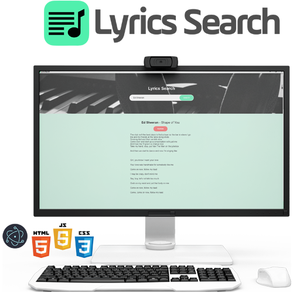

<h1 align="center">

 
 
</h1>

## 📖 Sobre o projeto

**Aplicação desktop utilizando framework JavaScript(Electron)**

- **Estrutura da aplicação feita utilizando HTML.**
- **Estilo e animações com uso de CSS.**
- **Interação da aplicação com JavaScript.**
- **Framework Electron utilizando tecnologias web para criar aplicação desktop de forma fácil e produtiva.**

🎨 Criação da identidade visual do projeto

## 🤖 Tecnologias

**Tecnologias usadas no layout**

- [HTML 5](https://www.w3schools.com/html/)
- [CSS 3](https://www.w3schools.com/css/)
- [JavaScript](https://www.w3schools.com/js/DEFAULT.asp)
- [Electron](https://www.electronjs.org/)
   
- [Photoshop](https://www.adobe.com/br/products/photoshop.html?sdid=KQPOM&mv=search&ef_id=CjwKCAiAnIT9BRAmEiwANaoE1Uqfjh7oNsu1Mx3eRFfIqKeKmbK3vyCj6T_v6QtwRTw2UTpv9OH_qxoCAHkQAvD_BwE:G:s&s_kwcid=AL!3085!3!459896307547!e!!g!!photoshop!188192502!10077842982&gclid=CjwKCAiAnIT9BRAmEiwANaoE1Uqfjh7oNsu1Mx3eRFfIqKeKmbK3vyCj6T_v6QtwRTw2UTpv9OH_qxoCAHkQAvD_BwE)
